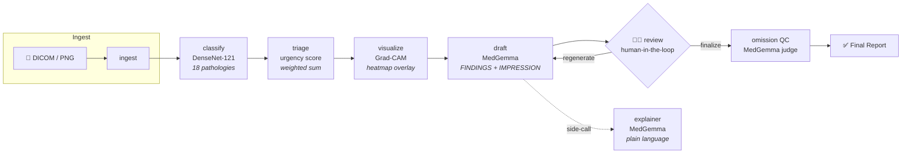

<div align="center">

<br>

# 🫁 RadQuant

### Quantified Triage & Reporting for Chest Radiography

**A privacy-first, locally-deployable AI workstation for chest X-ray interpretation**

*The **product** is a **chest-X-ray reading workstation** — worklist triage, report drafting, omission QC, localization, segmentation and a patient explainer, all on-device. The reasoning **engine** behind it (MedGemma 1.5 4B) is **benchmarked at GPT-4o level on ChestAgentBench** — at zero API cost, with no patient data leaving the building.*

<br>

[](https://www.python.org/downloads/)
[](LICENSE)
[](https://huggingface.co/google/medgemma-1.5-4b-it)
[](#-why-radquant)
[](https://fastapi.tiangolo.com)
[](https://nextjs.org)

</div>

<br>

> [!CAUTION]
> **Research / assistive demo — not a medical device.** No report is finalized without a radiologist in the loop. This system is designed to *assist*, not replace, clinical decision-making.

---

## 📋 Table of Contents

- [Why RadQuant](#-why-radquant)
- [Key Results](#-key-results)
- [Features](#-features)
- [Architecture](#-architecture)
- [Tech Stack](#-tech-stack)
- [Repository Structure](#-repository-structure)
- [Getting Started](#-getting-started)
- [Usage](#-usage)
- [Evaluation & Benchmarks](#-evaluation--benchmarks)
- [How It Works — Deep Dive](#-how-it-works--deep-dive)
- [Limitations](#-limitations)
- [Future Work](#-future-work)
- [Attribution & References](#-attribution--references)
- [License](#-license)

---

## 🎯 Why RadQuant

State-of-the-art chest X-ray agents like **MedRAX** (ICML 2025) achieve their accuracy by routing every image through **GPT-4o** — a proprietary, cloud-only, per-call-billed model. For real radiology practices, that's a non-starter:

| Problem | Impact |
|---|---|
| 🔒 **Patient data leaves the hospital** | HIPAA/GDPR violations |
| 💸 **Per-call API costs** | Scales with every study |
| 🌐 **Cloud dependency** | No offline/air-gapped operation |
| 🏥 **No workflow integration** | Single-image research UI only |

**RadQuant solves all four:**

- ✅ **Fully local** — entire medical reasoning path runs on open weights, on-premise
- ✅ **Zero API cost** — one 24 GB GPU, no cloud billing
- ✅ **Clinical workflow** — worklist triage, draft editing, omission QC, patient explainer
- ✅ **Knows when it doesn't know** — calibrated uncertainty with selective prediction

---

## 📊 Key Results

### ChestAgentBench (500-question eval, 7 reasoning categories)

| System | Backbone | Overall Accuracy | Hardware / Cost |
|---|---|:---:|---|
| MedRAX *(published SOTA)* | GPT-4o + 7 tools | **63.1%** | GPT-4o API 💸 |
| Llama-3.2-90B-Vision | 90B params | 57.9% | ~180 GB VRAM |
| **RadQuant (ours)** | **MedGemma-1.5-4B** | **57.6%** | **1× L4 GPU, $0** |
| GPT-4o | — | 56.4% | GPT-4o API 💸 |
| CheXagent | 8B medical VLM | 39.5% | — |

> **RadQuant beats GPT-4o head-to-head** (57.6% vs 56.4%) using a model that is **14× smaller**, runs on a **single consumer GPU**, and costs **$0 in API fees**.

> [!NOTE]
> **What this number measures.** ChestAgentBench is the multiple-choice reasoning benchmark from the MedRAX paper (chest case reports from Eurorad, whose figures span X-ray, CT and other modalities). It scores the **reasoning engine** — how well the model answers chest-imaging questions — *not* the workstation's triage/draft/QC features. The product is a chest-X-ray workstation; this benchmark is how we prove the open-weights engine inside it is competitive with GPT-4o. The two claims are kept deliberately separate.

### Selective Prediction — "The Quant"

RadQuant's signature contribution: **uncertainty-aware abstention**. On the cases it's confident about (~70%), RadQuant scores **66.7% — exceeding even MedRAX's all-case 63.1%** — and routes the uncertain ~30% to a radiologist.

| Policy | Coverage | Accuracy | Deferred |
|---|:---:|:---:|:---:|
| Answer everything | 100% | 59.2% | 0% |
| Defer low-agreement (τ≥0.5) | 80% | 65.6% | 20% |
| **Defer more (τ≥0.75)** | **70%** | **66.7%** | **30%** |
| Only unanimous (τ=1.0) | 54% | 67.7% | 46% |

### Per-Category Breakdown vs GPT-4o

| Category | RadQuant | GPT-4o | Δ |
|---|:---:|:---:|:---:|
| Detection | 61.4% | 58.7% | **+2.7** ✅ |
| Classification | 59.7% | 54.6% | **+5.1** ✅ |
| Diagnosis | 58.2% | 52.6% | **+5.6** ✅ |
| Characterization | 56.8% | 56.1% | **+0.7** ✅ |
| Comparison | 56.0% | 55.5% | **+0.5** ✅ |
| Relationship | 55.7% | 59.0% | −3.3 |
| Localization | 54.5% | 59.0% | −4.5 |

**Wins 5 of 7 categories.** Trails only on multi-image spatial reasoning — expected for a 4B model.

---

## 🏥 Features

| # | Workflow | Description | Technology |
|:---:|---|---|---|
| 🚦 | **Case Triage** | Classifier-driven urgency scoring reorders the worklist, surfacing critical cases first | TorchXRayVision DenseNet-121 + literature-anchored tiering (ACR/Annarumma/Baltruschat) |
| 📝 | **Draft Report** | FINDINGS/IMPRESSION generation grounded in detected pathologies, with Grad-CAM heatmap visualization | MedGemma 1.5 4B (multimodal) + pytorch-grad-cam |
| 🎯 | **Finding Localization** | Bounding-box detection of findings (effusion, pneumothorax, opacity, nodule/mass, cardiomegaly) with color-coded overlays — *shows where, not just what* | MedGemma-1.5-4B grounding fine-tune + IoU-NMS |
| 🫁 | **Anatomy Segmentation** | Translucent lung-field + heart overlays for anatomical context | TorchXRayVision ChestX-Det PSPNet |
| 🤖 | **Case Assistant** | Ask any question about a case — a tool-using agent calls MedGemma-VQA, the classifier, localization, and segmentation, then answers with cited evidence | LangGraph ReAct + NVIDIA/Groq orchestrator |
| 🛡️ | **Omission QC** | Safety net that flags high-confidence classifier findings missing from the edited report | Synonym map + MedGemma LLM-as-judge (text-only) |
| 🗣️ | **Patient Explainer** | Plain-language, modality-agnostic translation of any radiology report (CT, MRI, US, X-ray) | MedGemma 1.5 4B (text-only path) |
| 📊 | **Selective Prediction** | Per-case confidence scoring via sample-agreement — defers uncertain cases to the radiologist | Multi-sample voting + calibrated abstention |

---

## 🏗️ Architecture

RadQuant is built as a **LangGraph state machine** where each node performs one clinical function. All nodes read from and write to a shared `CaseState`:



### Key Design Decisions

- **Human-in-the-loop interrupt** before the `review` node — no report is ever finalized without radiologist approval
- **Two-stage omission QC** — lexical synonym matching (fast, deterministic) → LLM judge fallback (catches novel phrasings)
- **Singleton model loading** — MedGemma (~8 GB) is loaded once and shared across all nodes via a thread-safe singleton
- **Fully-local medical path** — triage, drafting, QC, the explainer, classification, localization and segmentation run entirely on-device. The **only** external call is the optional interactive assistant's tool-orchestration, which uses a free open LLM via NVIDIA NIM (`Llama-3.3-70B`; Groq `gpt-oss-120b` also supported). No patient image ever leaves the machine.
- **Beyond the core graph** — finding **localization** (boxes), anatomy **segmentation**, **selective prediction**, and the tool-using **assistant** sit alongside the pipeline above.

---

## ⚙️ Tech Stack

| Layer | Technology | Details |
|---|---|---|
| **Medical VLM** | [MedGemma 1.5 4B](https://huggingface.co/google/medgemma-1.5-4b-it) | Gemma3 architecture, bf16 inference, ~8.7 GB VRAM, ~15.6 tok/s on L4 |
| **CXR Classifier** | [TorchXRayVision](https://github.com/mlmed/torchxrayvision) | DenseNet-121, pretrained, 18 pathologies |
| **Localization** | MedGemma-1.5-4B grounding fine-tune | Bounding-box findings on frontal CXRs + IoU-NMS |
| **Segmentation** | TorchXRayVision ChestX-Det PSPNet | Lung-field + heart masks, cardiothoracic ratio |
| **Explainability** | [pytorch-grad-cam](https://github.com/jacobgil/pytorch-grad-cam) | Grad-CAM heatmaps on classifier activations |
| **Orchestration** | [LangGraph](https://langchain-ai.github.io/langgraph/) + [LangChain](https://www.langchain.com/) | State machine + tool-using ReAct assistant |
| **Orchestrator LLM** | NVIDIA NIM `Llama-3.3-70B` *(Groq `gpt-oss-120b` optional)* | Free-tier, open-weights, OpenAI-compatible; **assistant/eval only — not the medical path** |
| **DICOM** | [pydicom](https://pydicom.github.io/) | DICOM → PNG conversion + metadata extraction |
| **Web app** | [Next.js 14](https://nextjs.org) + [Tailwind](https://tailwindcss.com) frontend · [FastAPI](https://fastapi.tiangolo.com) backend | Clinical dark-theme workstation UI *(a legacy Streamlit app also ships under `radquant/ui/`)* |
| **Compute** | NVIDIA L4 (24 GB) | Single GPU, CUDA 12.8, Lightning.ai studio |
| **Evaluation** | [ChestAgentBench](https://huggingface.co/datasets/wanglab/chest-agent-bench) | 2,500 MCQs across 7 clinical reasoning categories |

### Model VRAM Budget (L4 24 GB)

| Model | Precision | VRAM | Load Time |
|---|---|---|---|
| MedGemma 1.5 4B | bf16 | ~8.7 GB | ~15s |
| TorchXRayVision DenseNet-121 | fp32 | ~0.1 GB | ~2s |
| **Total at inference** | — | **~9 GB / 24 GB** | — |

---

## 📁 Repository Structure

```
RadQuant/
│
├── radquant/                    # Main Python package
│   ├── __init__.py              # Package init, version
│   ├── config.py                # Credential & runtime resolution (HF, Groq, NVIDIA)
│   ├── state.py                 # CaseState TypedDict — shared LangGraph state
│   ├── graph.py                 # Full LangGraph state machine wiring
│   ├── worklist.py              # Urgency-sorted, JSON-persisted case store
│   │
│   ├── models/                  # Model loaders & wrappers
│   │   ├── medgemma.py          # MedGemma singleton: single/multi-image generate
│   │   └── medgemma_tool.py     # LangChain BaseTool wrapper for orchestrator
│   │
│   ├── nodes/                   # LangGraph nodes (one concern per module)
│   │   ├── classify.py          # 18-pathology classifier (TorchXRayVision)
│   │   ├── triage.py            # Urgency scoring with literature-anchored weights
│   │   ├── visualize.py         # Grad-CAM heatmap generation
│   │   ├── draft.py             # MedGemma draft report (FINDINGS + IMPRESSION)
│   │   ├── qc.py                # Omission QC: synonym match + LLM judge
│   │   └── explain.py           # Plain-language report translation + glossary
│   │
│   ├── prompts/                 # Prompt templates
│   │   ├── draft_report.py      # Draft generation prompt with classifier grounding
│   │   ├── explainer.py         # Patient-friendly translation prompts
│   │   └── synonyms.py          # 18-pathology synonym map for QC
│   │
│   ├── foundation/              # Stripped MedRAX scaffold (Apache-2.0 derivative)
│   │   ├── NOTICE.md            # MedRAX attribution & change log
│   │   ├── agent.py             # LangGraph agent loop (process ↔ execute)
│   │   ├── build.py             # Agent builder (Groq/NVIDIA backends)
│   │   └── tools/               # Classifier, DICOM processor, image visualizer
│   │
│   ├── eval/                    # ChestAgentBench evaluation
│   │   ├── chestagentbench.py   # Resumable harness with live scoreboard
│   │   ├── direct.py            # Direct multi-image VLM evaluation
│   │   ├── agentic.py           # Perceive → decide agent evaluation
│   │   ├── uncertainty.py       # Sample-agreement selective prediction
│   │   └── results.md           # Full benchmark results & analysis
│   │
│   └── ui/                      # Streamlit multi-page application
│       ├── app.py               # Main app entry (st.navigation)
│       ├── theme.py             # Design system: CSS, urgency pills, badges
│       ├── worklist.py          # Worklist page — cases ranked by urgency
│       ├── case_view.py         # Case workflow: draft, heatmap, QC, finalize
│       ├── explainer.py         # Report → plain-language translation
│       ├── qc_panel.py          # Omission warnings with dismiss/add controls
│       └── settings.py          # Runtime info, model IDs, credentials status
│
├── scripts/                     # Setup, validation, and evaluation runners
│   ├── setup.py                 # Idempotent environment setup (deps, models, data)
│   ├── smoke_test.py            # Full-stack validation
│   ├── run_eval.py              # ChestAgentBench evaluation launcher
│   ├── run_uncertainty.py       # Selective prediction evaluation
│   ├── selective_analysis.py    # Uncertainty analysis & reporting
│   ├── bench_medgemma.py        # MedGemma performance benchmark
│   └── phase*_check.py          # Per-phase verification scripts
│
├── tests/                       # Unit tests
│   ├── test_triage.py           # Urgency scoring & tier mapping
│   ├── test_draft.py            # Draft report generation & parsing
│   ├── test_qc.py               # Omission QC with stub judge
│   ├── test_explain.py          # Explainer & glossary parsing
│   ├── test_graph.py            # LangGraph state machine integration
│   └── test_medgemma.py         # MedGemma model tests
│
├── .streamlit/config.toml       # Streamlit dark theme configuration
├── .env.example                 # Credential template
├── pyproject.toml               # Package definition & dependencies
├── PLAN.md                      # Detailed 9-phase build plan
├── CLAUDE.md                    # Development notes & environment facts
├── LICENSE                      # Apache 2.0
└── README.md                    # This file
```

---

## 🚀 Getting Started

### Prerequisites

- **GPU**: NVIDIA T4 (16 GB) or L4 (24 GB) — tested on Lightning.ai
- **Python**: 3.10+
- **CUDA**: 12.x with PyTorch pre-installed
- **Accounts**: HuggingFace (free; required for weights) + NVIDIA NIM or Groq (free tier; for the assistant/eval only)

### 1. Clone & Setup

```bash
git clone https://github.com/Mohamed-Yossri/RadQuant.git
cd RadQuant
```

### 2. Configure Credentials

Set these as environment variables or in a `.env` file (see `.env.example`):

| Variable | Source | Purpose |
|---|---|---|
| `HF_TOKEN` | [HuggingFace tokens](https://huggingface.co/settings/tokens) | Download MedGemma weights (required) |
| `NVIDIA_KEY` | [NVIDIA NIM](https://build.nvidia.com/) | Orchestrator for the interactive assistant + eval |
| `GROQ_TOKEN` *(optional)* | [Groq console](https://console.groq.com) | Alternative orchestrator backend |

> The **medical path runs fully local** and needs only `HF_TOKEN`. An orchestrator key (`NVIDIA_KEY`, or `GROQ_TOKEN`) is only needed for the optional tool-using **assistant** and the benchmark eval.

> [!IMPORTANT]
> **One-time step**: Accept the MedGemma license at [huggingface.co/google/medgemma-1.5-4b-it](https://huggingface.co/google/medgemma-1.5-4b-it) — approval is automatic.

### 3. Run Automated Setup

```bash
python scripts/setup.py
```

This single command handles everything:
- Installs all dependencies (`pip install -e .`)
- Detects GPU and configures quantization (bf16 on L4, 4-bit on T4)
- Downloads and caches MedGemma weights (~8 GB)
- Downloads TorchXRayVision classifier weights
- Fetches ChestAgentBench dataset
- Validates Groq endpoint connectivity
- Prints a full environment summary

### 4. Validate

```bash
python scripts/smoke_test.py    # End-to-end stack validation
```

---

## 💻 Usage

### Launch the Application

The web app is a Next.js frontend (`:3000`) that proxies to a FastAPI backend (`:8000`):

```bash
# one command — boots backend + frontend + a public tunnel
bash scripts/serve_web.sh

# …or with Docker
docker compose up

# …or manually
uvicorn backend.main:app --port 8000          # backend
cd frontend && npm install && npm run dev      # frontend → http://localhost:3000
```

The workstation has six pages:

| Page | What You Do |
|---|---|
| **📋 Worklist** | All cases ranked by urgency, with a thumbnail per study. "Seed Cases" ingests the bundled real chest X-rays through the classify → triage pipeline; "Upload Study" adds your own. |
| **🩺 Active Case** | Open a case → generate draft report + Grad-CAM → localize / segment → edit findings → omission QC → finalize. Ask the tool-using assistant about the image. |
| **🕸️ Insights Graph** | An Obsidian-style knowledge graph linking cases to the pathologies they share, with cohort signals. |
| **🧠 General Medical** | Drop in *any* medical image (CT, MRI, dermatology, fundus, histopathology) → MedGemma auto-detects the modality, writes a domain-appropriate description, and answers questions. No CXR specialist tools run here; if it detects a chest X-ray it offers to open the full workstation instead. |
| **🗣️ Patient Explainer** | Paste any radiology report (any modality) → plain-language patient version with hover glossary. |
| **⚙️ System Settings** | Models, inference config, detection thresholds, and the product-vs-benchmark scope note. |

> The **General Medical** page exists because the engine — Google's MedGemma 4B — is a *general* medical vision-language model (trained on chest X-ray, CT, dermatology, fundus and histopathology; see Google's published benchmarks: SLAKE 72.3, PathMCQA 69.8, DermMCQA 71.8, EyePACS 64.9). RadQuant's **depth** is chest X-ray (classifier, grounding, segmentation, triage); this page surfaces the engine's **breadth** without pretending the specialist tools generalize.

*(A legacy Streamlit UI also ships: `streamlit run radquant/ui/app.py`.)*

### Run Benchmarks

```bash
# Direct VLM evaluation (the 57.6% result)
python scripts/run_eval.py --direct --limit 500

# Agent-based evaluation
python scripts/run_eval.py --limit 30 --backend nvidia

# Selective prediction (uncertainty)
python scripts/run_uncertainty.py --limit 120 --k 4
```

### Run Tests

```bash
pytest tests/ -v
```

---

## 📈 Evaluation & Benchmarks

### Methodology

We evaluate on [ChestAgentBench](https://huggingface.co/datasets/wanglab/chest-agent-bench) — a benchmark of 2,500 six-choice MCQs across 675 Eurorad chest imaging cases, testing 7 clinical reasoning skills. Our eval uses a reproducible 500-question random subset (seed=0, 95% CI ≈ ±4.3%).

### The Key Insight: Architecture > Model Size

Our first design — a blind text orchestrator (Llama-3.3-70B) relaying MedGemma's free-text descriptions — scored only **36.7%**. The orchestrator couldn't see the image and lost the visual detail needed to discriminate between options.

**The fix was architectural**: letting MedGemma see all figures directly and answer the question itself (multi-image, options-aware, concise chain-of-thought) lifted accuracy to **57.6% — a +21-point improvement — running 6× faster** (8 s/question vs 50 s/question).

### Ablations

| Variant | Accuracy | Δ vs Best |
|---|:---:|:---:|
| **Greedy multi-image CoT (k=1)** | **62.5%** | — *(best)* |
| + Self-consistency (k=5, majority vote) | 51.5% | **−11 pts** |
| + Pan-and-scan (high-res tiling) | 62.5% | ±0 |

Self-consistency *hurts* at 4B scale — temperature sampling introduces more noise than diversity. The winning recipe is simple: **greedy multi-image chain-of-thought**.

> Full per-category results, ablations, and methodology: [`radquant/eval/results.md`](radquant/eval/results.md)

---

## 🔬 How It Works — Deep Dive

### Triage System

Urgency scoring uses a weighted sum of classifier probabilities with **literature-anchored weights**:

| Tier | Time Sensitivity | Pathologies | Weight |
|---|---|---|:---:|
| 🔴 Critical | Immediate | Pneumothorax, Pneumonia | 1.0 |
| 🟠 Urgent | Within hours | Effusion, Consolidation, Edema, Lung Lesion, Mass | 0.6 |
| 🟡 Important | Same-day | Cardiomegaly, Nodule, Infiltration, Opacity, Fracture, etc. | 0.4 |
| 🟢 Chronic | Follow-up | Atelectasis, Emphysema, Fibrosis, Hernia | 0.2 |

```python
urgency_score = Σ(weight[pathology] × probability[pathology])
```

> **Caveat**: Weights are anchored on ACR Actionable Reporting and Annarumma/Baltruschat published orderings — literature defaults, not site-validated. Real deployment requires calibration against local data.

### Omission QC — Two-Stage Safety Net

After the radiologist edits the draft, QC checks each finding with confidence > 0.7:

1. **Lexical match** (fast, deterministic): Does any known synonym appear in the report?
   - Example: "effusion" → also matches "blunting of the costophrenic angle"
2. **LLM judge** (fallback): If no synonym matched, ask MedGemma: "Does this report address this finding?"

Only findings that survive **both** stages are flagged as omissions.

### Selective Prediction

For each case, we sample the model's reasoning K=4 times at temperature 0.7. The **agreement rate** with the greedy answer serves as a calibrated confidence signal:

- **High agreement** (all samples agree) → model is genuinely confident → answer
- **Low agreement** (samples disagree) → uncertainty → defer to radiologist

This is a *behavioral* confidence measure, not self-reported — the model's own confidence ratings are poorly calibrated (53% accurate at "High").

---

## ⚠️ Limitations

We believe in honest reporting. These are real limitations, not fine print:

| Limitation | Details |
|---|---|
| **Research only** | Not a certified medical device. Never use for clinical decisions without radiologist oversight. |
| **Eval subset** | Benchmarked on 500 of 2,500 questions (±4.3% CI). Agent config measured on n=30. |
| **Spatial reasoning** | A 4B model trails frontier models on multi-image spatial tasks (localization −4.5%, relationship −3.3% vs GPT-4o). |
| **Classifier OOD** | TorchXRayVision is trained on standard CXRs — performance degrades on CT panels, annotated multi-image figures, and non-standard views. |
| **Urgency weights** | Literature-anchored, not site-calibrated. Require local validation before any deployment. |
| **Single modality** | Deep support for CXR only. The explainer is modality-agnostic (text-only), but triage/draft/QC are CXR-specific. |

---

## 🔮 Future Work

- **CT support via MONAI** — lung nodule detection (LIDC-IDRI bundle) with slice-scrolling viewer
- **Multi-image studies** — PA + lateral view joint analysis
- **Radiologist user study** — qualitative feedback from N≥1 radiologists on 30+ cases
- **Pathology-weight calibration** — urgency weights validated against clinical triage data
- **Arabic explainer** — MEA-region deployment via Groq-hosted Arabic models
- **PACS integration** — DICOMweb C-STORE for hospital system integration
- **Voice dictation** — Whisper-based report editing (closer to radiology workflows)

---

## 🏆 How RadQuant Compares

We benchmark against **MedRAX** (the current state of the art on ChestAgentBench) as the reference point — it pairs a GPT-4o backbone with a 7-tool agent. RadQuant takes a deliberately different posture: **on-device, open-weights, workflow-first**, with a safety layer the cloud systems don't ship.

| Dimension | Cloud SOTA (MedRAX / GPT-4o) | RadQuant |
|---|---|---|
| **Medical backbone** | GPT-4o (proprietary, cloud) | MedGemma-1.5-4B (open, local) |
| **API cost** | Per-call billing | $0 (medical path) |
| **Patient data** | Sent to a cloud API | Never leaves the machine |
| **Interface** | Single-image research chat | Multi-case worklist + tool-using assistant |
| **Localization** | — | Bounding-box findings + anatomy segmentation |
| **Safety / uncertainty** | — | Omission QC + selective prediction (66.7% @ 70% coverage) |
| **Accuracy (ChestAgentBench)** | 63.1% (MedRAX) / 56.4% (GPT-4o, single model) | 57.6% single-model — *beats GPT-4o head-to-head* |

---

## 📚 Attribution & References

RadQuant uses **ChestAgentBench** for evaluation and reuses a small Apache-2.0 orchestration scaffold from **MedRAX** (see [License](#-license)); MedRAX is also our SOTA benchmark reference. Please cite the sources below.

### Papers

- **MedRAX**: Fallahpour et al., "MedRAX: Medical Reasoning Agent for Chest X-ray," ICML 2025. [arXiv:2502.02673](https://arxiv.org/abs/2502.02673)
- **MedGemma**: Google, "Next-generation medical image interpretation with MedGemma 1.5." [Blog](https://research.google/blog/next-generation-medical-image-interpretation-with-medgemma-15-and-medical-speech-to-text-with-medasr/)
- **TorchXRayVision**: Cohen et al., MIDL 2022. [GitHub](https://github.com/mlmed/torchxrayvision)
- **ChestAgentBench**: Wang Lab. [HuggingFace](https://huggingface.co/datasets/wanglab/chest-agent-bench)
- **CXR grounding model**: `alex-feeel/medgemma-cxr-auditor-v2` — a MedGemma-1.5-4B fine-tune for bounding-box findings ([CXR Draft Auditor](https://huggingface.co/spaces/build-small-hackathon/cxr-draft-auditor), HAI-DEF, research-only). Used as RadQuant's localization tool with the author's pinned prompt.
- **ACR Actionable Reporting**: [ACR Practice Parameters](https://www.acr.org/Clinical-Resources/Practice-Parameters-and-Technical-Standards)
- **Annarumma et al.**: "Automated triaging of adult chest radiographs with deep artificial neural networks," Radiology 2019.
- **Baltruschat et al.**: "Smart chest X-ray worklist prioritization using AI," European Radiology 2021.

### Software

- [LangGraph](https://langchain-ai.github.io/langgraph/) · [pytorch-grad-cam](https://github.com/jacobgil/pytorch-grad-cam) · [pydicom](https://pydicom.github.io/) · [Streamlit](https://streamlit.io)

---

## 📄 License

This project is licensed under the **Apache License 2.0** — see the [LICENSE](LICENSE) file.

The `radquant/foundation/` directory contains code derived from [MedRAX](https://github.com/bowang-lab/MedRAX) (Apache-2.0). See [`radquant/foundation/NOTICE.md`](radquant/foundation/NOTICE.md) for detailed attribution.

Medical models carry their own licenses:
- **MedGemma 1.5 4B**: [Health AI Developer Foundations (HAI-DEF) License](https://huggingface.co/google/medgemma-1.5-4b-it)
- **TorchXRayVision**: [Apache-2.0](https://github.com/mlmed/torchxrayvision/blob/master/LICENSE)

---

<div align="center">

**Built with ❤️ for safer, more accessible radiology AI**

*If you find this work useful, please ⭐ the repository and cite the references above.*

</div>
